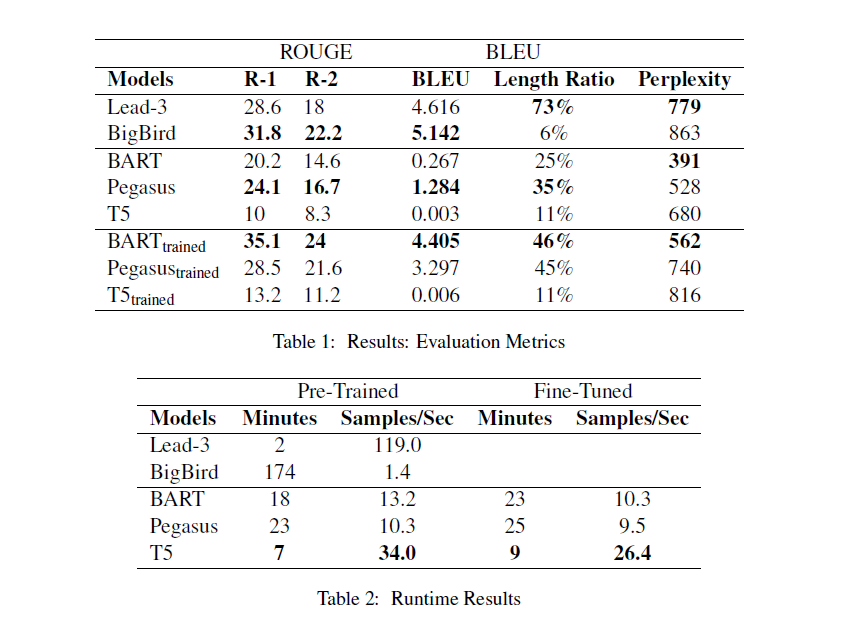

# Fine-tuning HuggingFace Models

## Overview

This project compares the performance of pre-trained and fine-tuned LLMs on BigPatent (from the python package Datasets) approximating new, unseen vocabulary. Models chosen for the project are the smaller variants of their originals (e.g. distilbart-xsum-12-1) designed for more affordable tuning and less latency.

The results find that fine-tuning significantly improves performance, and that smaller models can be advantageous for NLP practitioners who favor speed over quality. Read the full paper [here](assets/pdf/SI_630_Project_Final%20(1).pdf).

## Architecture

Baseline Models
- **Lead 3:** first three sentences
- **BigBird:** BART fine-tuned on BigPatent

Variant Models
- **BART:** *(distilbart-xsum-12-1)*
- **Pegasus:** *(distill-pegasus-xsum-16-4)*
- **T5:** *(t5-small)*